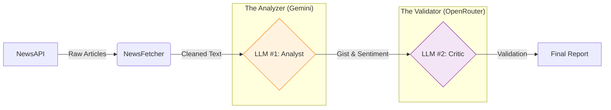

# 🗞️ NewsTruth: AI-Powered News Analysis & Validation Pipeline

> **"Trust, but verify."** — This project implements a **Dual-LLM Architecture** to fetch, analyze, and fact-check political news in real-time.


## 🚀 The Concept
In the age of AI hallucinations, a single model isn't enough. **NewsTruth** builds a self-correcting pipeline where:
1.  **The Analyst (Gemini)** reads the news and extracts sentiment, tone, and a gist.
2.  **The Critic (Mistral/OpenRouter)** reviews the Analyst's work against the source text to flag inconsistencies or bias.

This **Agentic Workflow** ensures higher reliability than standard "wrapper" scripts.

## 🏗️ Architecture


## ✨ Key Features
-   **🛡️ Dual-Layer Verification**: Analysis is only accepted if it passes the Critic's validation.
-   **🔌 Plug-and-Play Modules**: Separate classes for Fetching, Analyzing, and Validating allow for easy API swaps.
-   **⚡ Robust Error Handling**: Gracefully handles API timeouts, rate limits, and malformed JSON responses.
-   **📊 Automated Reporting**: Generates a human-readable Markdown report + raw JSON data for downstream tasks.

## 🛠️ Installation & Setup

### 1. Clone the Repo
```bash
git clone https://github.com/yourusername/news-analyzer.git
cd news-analyzer
```

### 2. Install Dependencies
```bash
pip install -r news-analyzer/requirements.txt
```

### 3. Configure API Keys
Create a `.env` file in `news-analyzer/` and add your keys:
```env
NEWSAPI_KEY=your_key
GEMINI_API_KEY=your_key
OPENROUTER_API_KEY=your_key
```

### 4. Run the Pipeline
```bash
python news-analyzer/main.py
```

## 🧪 Testing
We use `pytest` with `unittest.mock` to verify logic without burning API credits.
```bash
# Windows (PowerShell)
$env:PYTHONPATH="news-analyzer"; pytest news-analyzer/tests/
```

## 📂 Project Structure
```text
news-analyzer/
├── main.py              # Orchestrator: Manages the workflow
├── news_fetcher.py      # Connects to NewsAPI with rate-limit handling
├── llm_analyzer.py      # The Analyst: Google Gemini integration
├── llm_validator.py     # The Critic: OpenRouter integration
├── output/              # Generated reports and data
└── tests/               # Unit tests ensuring stability
```

## 📝 Sample Output
> *From `output/final_report.md`*

### Article: "New Policy Announced..."
- **Source:** [India Today](...)
- **Gist:** The government introduced a new bill targeting...
- **LLM#1 Sentiment:** Positive
- **LLM#2 Validation:** ✓ Correct.
    - **Reasoning:** The text uses words like "historic gain" and "breakthrough".

---
*Built with ❤️ by [Your Name]*
